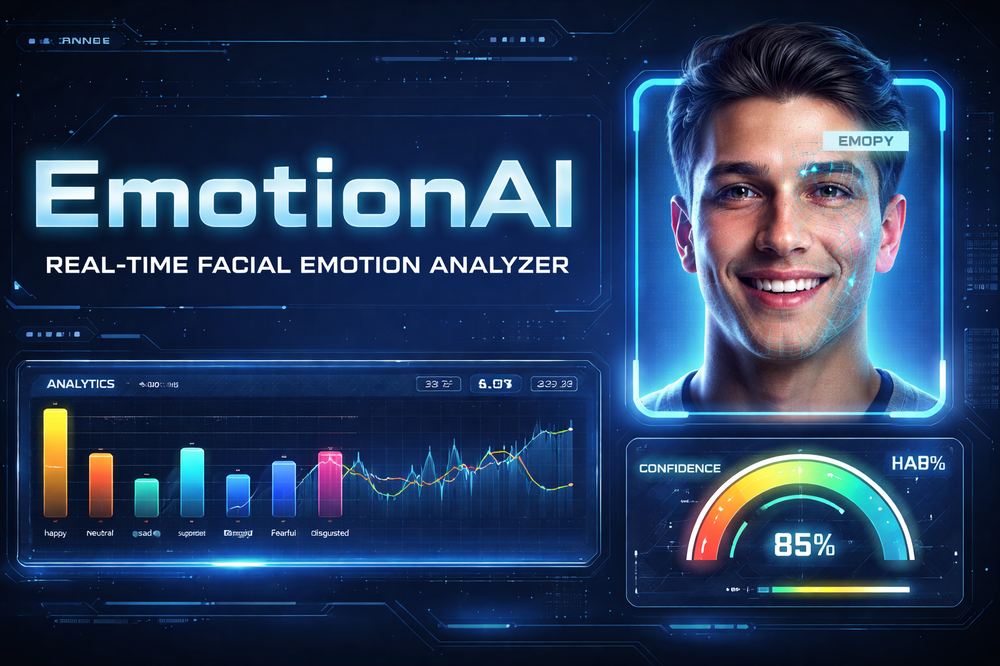

# 🧠 EmotionAI — Real-Time Facial Emotion Analyzer

<div align="center">



**A full-stack AI application that detects and analyzes human emotions in real-time using your webcam.**

[](https://python.org)
[](https://fastapi.tiangolo.com)
[](https://react.dev)
[](https://github.com/serengil/deepface)
[](LICENSE)

[Features](#-features) • [Demo](#-demo) • [Tech Stack](#-tech-stack) • [Quick Start](#-quick-start) • [Architecture](#-architecture) • [API Docs](#-api-reference)

</div>

---

## 🎯 Overview

EmotionAI is a production-grade, real-time emotion analysis system that uses computer vision and deep learning to classify facial expressions directly in your browser — with **zero data transmission** unless you opt in to backend processing.

The system detects 7 core emotions:

| Emotion | Emoji | Use Case |
|---------|-------|----------|
| Happy | 😄 | Engagement, satisfaction |
| Sad | 😢 | Discomfort, disengagement |
| Angry | 😠 | Frustration, stress |
| Neutral | 😐 | Baseline, composure |
| Surprised | 😲 | Alertness, discovery |
| Fearful | 😨 | Anxiety, stress |
| Disgusted | 🤢 | Discomfort, rejection |

---

## ✨ Features

### Core
- **Real-time webcam emotion detection** at 15–30 FPS
- **Live bounding boxes** with emotion labels + confidence scores on detected faces
- **7-emotion classification** using FER2013-trained deep learning models
- **Animated confidence meter** (gauge chart) updating every frame

### Analytics Dashboard
- **Live emotion breakdown bars** — all 7 emotions visualized simultaneously
- **60-second timeline chart** — emotion intensity over time
- **Session distribution pie chart** — aggregate emotion proportions
- **Session analytics**: dominant emotion, total frames, stability score, engagement score

### Specialized Modes
- 🎤 **Interview Mode** — Confidence level, stress detection, composure tracking
- 🎓 **Classroom Mode** — Attention level, boredom index, positive affect

### Utility Features
- **📸 Screenshot capture** — saves the current frame with overlay annotations
- **↓ CSV export** — full session log with timestamps, emotions, and confidence values
- **🔒 Privacy-first** — all AI processing runs locally in the browser (face-api.js)
- Optional **Python backend** (FastAPI + DeepFace) for higher-accuracy server-side inference

---

## 🖥️ Demo

> **Live demo (browser-only, no install needed):** Open `index.html` in any modern browser after building.

### Screenshots

```
[Webcam Feed]                    [Sidebar]
┌──────────────────────────┐    ┌──────────────┐
│ 📷 Live feed             │    │ 😄 HAPPY      │
│ ┌──────────┐             │    │ conf: 87%     │
│ │ HAPPY 87%│  face box   │    │ [gauge]       │
│ └──────────┘             │    ├──────────────┤
│ [LIVE] [15fps] [GENERAL] │    │ Analytics    │
└──────────────────────────┘    │ Dominant:    │
                                │ happy        │
[Emotion Bars]                  │ Frames: 842  │
happy     ████████░░  87%       │ Stability:78%│
neutral   ██░░░░░░░░   8%       │ Engage: 65%  │
sad       █░░░░░░░░░   3%       ├──────────────┤
angry     ░░░░░░░░░░   1%       │ [Timeline]   │
surprised ░░░░░░░░░░   1%       │ ~~~~~~~~~    │
fearful   ░░░░░░░░░░   0%       ├──────────────┤
disgusted ░░░░░░░░░░   0%       │ Interview    │
                                │ Confidence:  │
                                │ ████░ 72%    │
                                └──────────────┘
```

---

## 🛠️ Tech Stack

### Frontend
| Technology | Purpose |
|-----------|---------|
| React 18 + Vite | UI framework & build tool |
| face-api.js 0.22 | Client-side face detection & expression classification |
| TensorFlow.js | face-api.js runtime |
| Recharts | Timeline & distribution charts |
| CSS Modules | Scoped component styling |
| JetBrains Mono + Syne | Typography |

### Backend (optional, for higher accuracy)
| Technology | Purpose |
|-----------|---------|
| FastAPI | High-performance async REST API |
| DeepFace | State-of-the-art emotion detection (FER2013 CNN) |
| OpenCV | Image decoding & face detection fallback |
| Uvicorn | ASGI server |

### AI Models
| Model | Backend | Accuracy | Latency |
|-------|---------|----------|---------|
| face-api.js TinyFaceDetector + FaceExpressionNet | Browser | ~82% | ~30ms |
| DeepFace (VGG-Face / FER2013) | Python | ~88% | ~80ms |
| FER (MTCNN + CNN) | Python | ~85% | ~60ms |
| OpenCV Haar Cascade | Python fallback | detection only | ~10ms |

---

## 🚀 Quick Start

### Option A: Browser-Only (Fastest — No Backend Required)

```bash
# 1. Clone the repo
git clone https://github.com/yourname/emotion-ai.git
cd emotion-ai/frontend

# 2. Install dependencies
npm install

# 3. Start dev server
npm run dev

# 4. Open http://localhost:5173
# Click "Start Analysis" and allow camera access
```

That's it. The app downloads AI model weights from jsDelivr CDN on first load (~8MB).

---

### Option B: Full Stack (Frontend + Python Backend)

#### Backend Setup

```bash
cd emotion-ai/backend

# Create and activate virtual environment
python -m venv venv
source venv/bin/activate        # macOS/Linux
# venv\Scripts\activate         # Windows

# Install dependencies
pip install -r requirements.txt

# Start the API server
uvicorn main:app --host 0.0.0.0 --port 8000 --reload
```

The backend auto-downloads DeepFace models on first use (~500MB). API docs available at `http://localhost:8000/docs`.

#### Frontend Setup (with backend enabled)

```bash
cd emotion-ai/frontend

# Create .env file
echo "VITE_USE_BACKEND=true" > .env
echo "VITE_API_URL=http://localhost:8000" >> .env

npm install
npm run dev
```

---

### Option C: Docker Compose (Full Stack)

```bash
# From project root
docker-compose up --build

# Frontend: http://localhost:5173
# Backend:  http://localhost:8000
# API docs: http://localhost:8000/docs
```

---

## 📁 Project Structure

```
emotion-ai/
├── 📁 frontend/                    # React application
│   ├── 📁 src/
│   │   ├── 📁 components/
│   │   │   ├── Header.jsx          # App header with mode selector
│   │   │   ├── WebcamFeed.jsx      # Camera feed + overlay canvas
│   │   │   ├── EmotionPanel.jsx    # Live emotion bars
│   │   │   └── Sidebar.jsx         # Analytics, charts, insights
│   │   ├── 📁 hooks/
│   │   │   └── useEmotionDetection.js  # Core AI + webcam hook
│   │   ├── 📁 utils/
│   │   │   └── emotions.js         # Constants and helpers
│   │   ├── App.jsx
│   │   ├── index.css
│   │   └── main.jsx
│   ├── package.json
│   └── vite.config.js
│
├── 📁 backend/                     # Python FastAPI server
│   ├── main.py                     # API endpoints + model inference
│   └── requirements.txt
│
├── 📁 models/                      # Model info & weights (auto-downloaded)
│   └── README.md
│
├── 📁 docs/                        # Documentation assets
│   └── banner.png
│
├── docker-compose.yml
└── README.md
```

---

## 🌐 API Reference

### `POST /detect_emotion`

Analyze emotions from a base64-encoded webcam frame.

**Request body:**
```json
{
  "image": "data:image/jpeg;base64,/9j/4AAQ...",
  "session_id": "session_1720000000000",
  "mode": "interview"
}
```

**Response:**
```json
{
  "faces": [
    {
      "box": { "x": 120, "y": 80, "w": 200, "h": 220 },
      "emotions": {
        "happy": 0.72,
        "neutral": 0.18,
        "sad": 0.04,
        "angry": 0.02,
        "surprised": 0.02,
        "fearful": 0.01,
        "disgusted": 0.01
      },
      "dominant": "happy",
      "confidence": 0.72
    }
  ],
  "face_count": 1,
  "backend": "deepface",
  "latency_ms": 74.3,
  "session_id": "session_1720000000000",
  "timestamp": "2024-07-04T12:00:00.000Z"
}
```

---

### `GET /session_summary/{session_id}?mode=interview`

Get aggregated analytics for a session.

**Response:**
```json
{
  "session_id": "session_1720000000000",
  "frame_count": 450,
  "duration_seconds": 30.0,
  "dominant_emotion": "happy",
  "emotion_distribution": {
    "happy": 0.61,
    "neutral": 0.22,
    "sad": 0.07,
    "angry": 0.04,
    "surprised": 0.03,
    "fearful": 0.02,
    "disgusted": 0.01
  },
  "engagement_score": 78,
  "stability_score": 82,
  "mode": "interview",
  "insights": {
    "confidence_level": 72,
    "stress_level": 18,
    "composure": 22
  }
}
```

---

### `DELETE /session/{session_id}`

Clear session data (privacy compliance).

---

## ⚡ Performance

| Metric | Browser Mode | Backend Mode |
|--------|-------------|-------------|
| Detection latency | ~30–50ms | ~60–100ms |
| FPS (typical) | 15–25 fps | 10–15 fps |
| Model accuracy | ~82% | ~88% |
| Memory usage | ~120MB | ~600MB (Python) |
| Startup time | ~3s (CDN) | ~10s (model load) |

**Optimization tips:**
- Reduce video resolution to 320×240 for faster inference
- Use `TinyFaceDetector` (default) over full SSD for speed
- Set `inputSize: 160` in TinyFaceDetectorOptions for even faster detection
- Backend: use `detector_backend="opencv"` (fastest) or `"ssd_mobilenet"`

---

## 🔐 Privacy & Data Handling

EmotionAI is designed with privacy as a first principle:

- **No video is recorded** — only individual frames are processed
- **No data leaves your device** in browser-only mode
- **No data is stored** in backend mode unless you explicitly call the session API
- **Session data is ephemeral** — stored in memory, cleared on server restart
- **Clear session data** at any time via `DELETE /session/{session_id}`
- Model weights are loaded from jsDelivr CDN (face-api.js) or PyPI (DeepFace)

---

## 🚧 Future Improvements

- [ ] **Multi-face tracking** — independent timelines per detected person
- [ ] **PDF report export** — session summary with charts
- [ ] **Emotion history heatmap** — calendar-style view
- [ ] **WebSocket streaming** — replace HTTP polling for lower latency
- [ ] **Edge model deployment** — ONNX runtime for faster inference
- [ ] **Emotion alerts** — configurable thresholds with audio/visual notifications
- [ ] **Group mode** — aggregate emotions across multiple participants (classroom)
- [ ] **Mobile support** — responsive layout for tablet use
- [ ] **OAuth + persistent sessions** — opt-in data storage for longitudinal analysis
- [ ] **Voice + emotion fusion** — combine facial and speech emotion cues

---

## 🤝 Contributing

1. Fork the repo
2. Create a feature branch: `git checkout -b feat/my-feature`
3. Commit changes: `git commit -m 'feat: add my feature'`
4. Push: `git push origin feat/my-feature`
5. Open a Pull Request

---

## 📄 License

MIT License — see [LICENSE](LICENSE) for details.

---

<div align="center">
Built with ❤️ using React, FastAPI, and DeepFace
</div>
